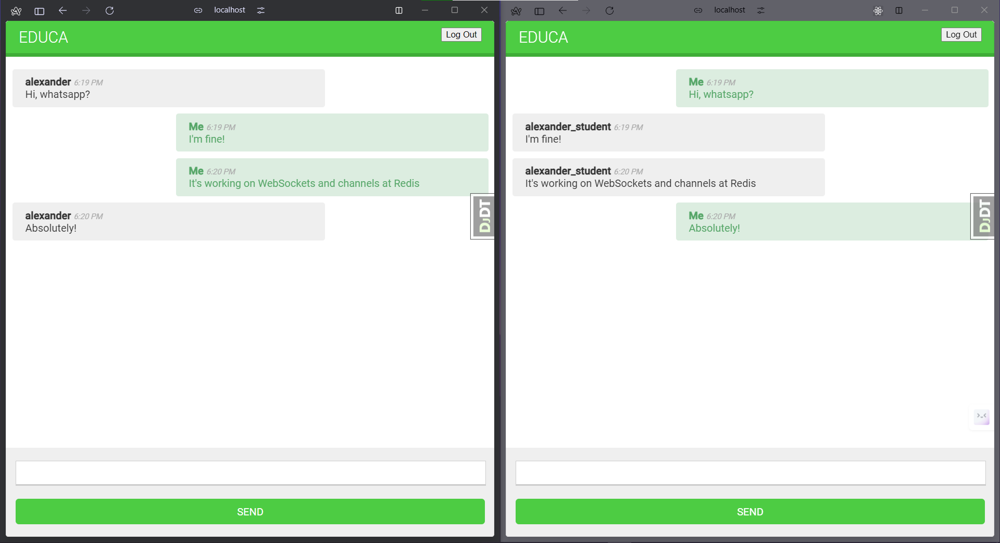

# Учебный проект образовательной платформы




## Функции приложения
- Аутентификация
- Список курсов по предметам
- Зачисление на курс
- Просмотр модулей курса с разным содержимым (текст, изображение, видео, файл)
- CMS (Content Management System) над курсами
- API
- Чат комната по каждому курсу

## Пройденные темы
- Модельное наследование
- Работа с группами и разрешениями
- Прорисовка и кэширование контента через Memcached и Redis
- Разработка RESTful API
- Чат-сервер на основе Django Channels
- Реализация Web-socket клиента и Web-socket потребителя
- Канальный слой с резидентным хранилищем Redis
- Dockerfile, Docker Compose
- NGINX

## Запуск
Запуск memcached
```shell
docker run -it --rm --name memcached -p 11211:11211 memcached -m 64
```

Запуск Redis
```shell
docker run -it --rm --name redis -p 6379:6379 redis
```


_Основано на материалах книги "Django 4 в примерах [2023] Антонио Меле"_